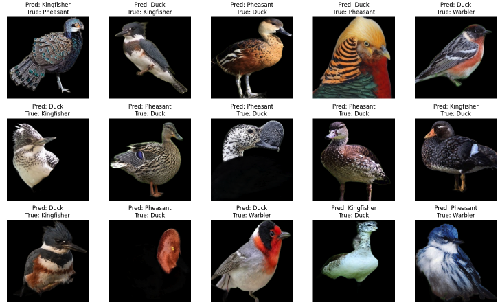

# Duck Duck Choose: Pecking at Pixels with Machine Learning

### Streamlit App: 

Classifying birds into 4 genuses using a CNN model: 

https://duck-duck-choose.streamlit.app/

# Project Overview

This project utilizes Computer Vision techniques to increase the quality and quantity of data collected in the conservation field. If successful, it will reduce the burden on developing countries to accurately document wildlife-related data, as well as aid in data collection for geographically challenging or expansive areas (for example: a migration pattern from North America to South America).

The project will attempt to find a solution to the following: 

"How might we use Computer Vision to increase the accuracy of bird species classification based on images?"

Computer Vision (CV) is a field of artificial intelligence that trains computers to interpret and understand the visual world. A properly trained model can accurately identify and classify large quantities of images. 

Computer Vision enables machines to interpret visual information akin to human sight. A well-trained CV model can efficiently categorize a vast array of images, proving invaluable in ecological research by facilitating:

Efficient data accumulation on species distribution and population.
Monitoring of migratory routes and environmental impact assessments.
Collective behavioral analysis for conservation strategy development.

[Source](https://aiworldschool.com/research/this-is-why-ai-in-wildlife-conservation-is-so-glorious/)

This project relies heavily on the interpretation of the relative difference or similarity of bird images across different species. 
Some [background information](https://www.allaboutcircuits.com/technical-articles/image-histogram-characteristics-machine-learning-image-processing/) on image histograms may be required. 

# Project Motivation

A 2022 [study](https://news.cornell.edu/stories/2022/05/global-bird-populations-steadily-decline) revealed that 48% of existing bird species worldwide are known or suspected to be undergoing population declines. Populations are only stable for 39% of species. Only 6% are showing increasing population trends, and the status of 7% is still unknown. Birds are important ecological indicators that are critical to many environmental monitoring schemes, bidiversity assessments and conservation decision-making.

Common reasons for the decline in bird populations include agricultural activity, urban development, natural resource extraction, chemical pesticides, and industrial contaminants. Loss of bird habitat affects both terrestrial and aquatic environments, including marine areas. 

According to conservation scientists, [current data collection approaches are not adequate](https://sekercioglu.biology.utah.edu/PDFs/2020%20Monitoring%20the%20world's%20bird%20population%20with%20community%20science%20data.pdf) for monitoring species across geographic ranges can be difficult and resource intensive, and rely too heavily on community data, which may be lacking in both data quantity and quality. 

In a few countries, birds are monitored using government-coordinated surveys that produce reliable national-level population trends. However, formal surveys such as these are often expensive, infrequent, not comprehensive, and don't capture the seasonal habits of species. Further, formal surveys may be lacking in developing nations due to the resources required. This is especially concerning because these regions harbor the majority of the world's bird species. 


## Data set

This project uses this [dataset](https://www.kaggle.com/datasets/gpiosenka/100-bird-species), which consists of 84635 training images, 2625 test images, and 2625 validation images across 525 bird species. There are no null or duplicate values. The images were cropped so that the bird in most cases occupies at least 50% of the pixel in the image, then resized to 224 X 224 X3 in jpg format. Each species has at least 130 training images. 

The data is pre-split into test, valid and train, so I didn't need to do my own split. I decided to keep the size at 224 x 224 rather than downsizing because I wanted my model to be able to distinguish as much visual data as possible. 

## Data Dictionary

<table>
  <tr>
    <th style="text-align: left;">Column Name</th>
    <th style="text-align: left;">Description</th>
  </tr>
  <tr>
    <td style="text-align: left"> <code>labels</code> </td>
    <td style="text-align: left">bird species associated with the image file</td>
  </tr>
    <tr>
    <td style="text-align: left"><code>scientific label</code></td>
    <td style="text-align: left">scientific name for the bird species</td>
  </tr>
  <tr>
    <td style="text-align: left"><code>filepaths</code></td>
    <td style="text-align: left">the relative file path to an image file</td>
  </tr>
    <tr>
    <td style="text-align: left"><code>data set</code></td>
    <td style="text-align: left">which dataset (train, test or valid) the image filepath belongs to</td>
  </tr>
      <tr>
    <td style="text-align: left"><code>data set</code></td>
    <td style="text-align: left">which dataset (train, test or valid) the image filepath belongs to</td>
  </tr>
       <tr>
    <td style="text-align: left"><code>class_id</code></td>
    <td style="text-align: left">the class index value associated with the image file's class</td>
  </tr>

</table>

### Dependencies

* Install all the basic packages we'll need.

```
conda install numpy=1.19.2 pandas=1.3.5 matplotlib jupyter 
```

* Users should install Tensorflow 2.13.0: 
```
conda install -c conda-forge tensorflow=2.13.0
```

* Install SciKit Learn: 
```
conda install scikit-learn=0.24.1 
```

* This project requires opencv-python to run
```
conda install opencv-python
```

* This project requires Pillow for image display
```
conda install Pillow
```

* This project requires rembg for background removal
```
conda install rembg
```

## Project Organization

At the root of this folder, I will have the original ```train```, ```valid```, and ```test``` data sets, as well as the new folders I've created in my feature engineering. I will have the original ```birds.csv``` . 


## CNN Base Model with 4 Genuses
### Data Restructuring
For a simple proof of concept, I decided to simplify my dataset by merging species into genus and constrain my dataset to only 4 genuses with fewer than 1200 training images, using only DUCK, WARBLER, PHEASANT, and KINGFISHER. 

<table>
  <tr>
    <th style="text-align: left;">Genus Name</th>
    <th style="text-align: left;">Count of Images</th>
  </tr>
  <tr>
    <td style="text-align: left"> <code>DUCK</code> </td>
    <td style="text-align: left">1510</td>
  </tr>
    <tr>
    <td style="text-align: left"><code>WARBLER</code></td>
    <td style="text-align: left">1391</td>
  </tr>
  <tr>
    <td style="text-align: left"><code>PHEASANT</code></td>
    <td style="text-align: left">1303</td>
  </tr>
    <tr>
    <td style="text-align: left"><code>KINGFISHER</code></td>
    <td style="text-align: left">1298</td>
</table>

I restructured my image folders as well, creating new folders for ```train-genus```, ```valid-genus```, and ```test-genus```, for the species' image folder to live inside. 


## Project Flowchart
My project direction will align with the following steps. Due the pre-split nature of my data, I didn't need to split train, valid and test data. 

<div style="background-color: white; padding: 10px;">

</div>

## Data Cleaning 
Using the python library `rembg`, I removed the backgrounds from the images 

<div style="background-color: white; padding: 10px;">

</div>

## Data Augmentation
Using ImageDataGenerator, I have performed data augmentation which did the following transformations on my data to increase the sample size that my model can learn from: 

``` 
    rotation_range=40,    # Rotate the images up to 40 degrees
    width_shift_range=0.2, # Shift the images horizontally by up to 20%
    height_shift_range=0.2,# Shift the images vertically by up to 20%
    shear_range=0.2,      # Shear transformation
    zoom_range=0.2,       # Zoom in/out
    horizontal_flip=True, # Allow horizontal flipping
    fill_mode='nearest'   # Strategy for filling in newly created pixels

```
In my transfer model training, I replaced these manual transforms with `tf.keras.applications.efficientnet.preprocess_input` as the preprocessing function for input into a customized EfficientNetB0 model.

# Base Model Evaluation 
My base CNN Mode's accuracy was 87%. My model predicted Ducks accurately 76% of the time, Kingfishers 90% of the tme, Pheasants 90% of the time, and Warblers 93% of the time. Limitations of the dataset are male/female species characteristics variability and class imbalance and juvenile/adult variability in physical characteristics.

# Base Model Confusion Matrix
<div style="background-color: white; padding: 10px;">

</div>

The base CNN model does the best at predicting Warblers and the worst at predicting Ducks.

# Base Model Incorrect Predictions
<div style="background-color: white; padding: 10px;">

</div>


 # Base Model Conclusion
 The base model is incorrectly predicting images based on the predicted species having similar colour, size, and pattern to the true species. The model may be too simple for this classification task, so I want to compare its results to a more sophisticated pretrained model.

 ## Streamlit App 
 I deployed a simple app on Streamlit where users can upload any bird image belonging to the 4 specified genus classes to get the model's prediction. 

 https://duck-duck-choose.streamlit.app/


## Transfer Learning with EfficientNetB0
To improve my model and to widen the scope to include all 525 species in my data set, I decided to implement transfer learning with a pre-trained CNN. I chose EfficientNetB0 because of its high accuracy and relatively small size. After importing `EfficientNetB0` from tensorflow.keras.appplications, I applied the following arguments: 

```weights='imagenet' ```
Using pre-trained weights allows the model to leverage knowledge gained from a large and diverse dataset, which can improve performance on my classification task. 

```pooling='max'```
After the final convolutional layer, a global max pooling operation is applied, which takes the maximum value over the entire feature map for each channel. This reduces the output to a fixed-size vector, making it easier to connect to subsequent dense layers, regardless of the input image size.

```include_top='False'```
This excludes the top (fully connected) layers of the model. The top layers are specific to the original classification task (1,000 classes from ImageNet). By setting include_top=False, I can add custom layers tailored to my specific problem. 

```input_shape=(height, width, channels)```
This specifies the dimensions of the input images the model should expect. This is necessary because `include_top=False` removes the original input layer, and a new input shape must be defined. The variables height, width, and channels should are set according to the size of my input images.

I performed data augmentation and preprocessed images for EfficientNetB0 with a preprocessing_function in my ImageDataGenerator.

```preprocessing_function=tf.keras.applications.efficientnet.preprocess_input```

I froze all the layers of the model, so that during backprop, the weights will not be updated. 

```
for layer in eff_model.layers:
  layer.trainable = False 
```

Then, I added custom Dense or fully-connected layers to tailor the model for my dataset.

```
x = eff_model.output # Gets the output from the pre-trained eff_model, which will be passed as input to the next layers
x = Dense(1024, activation='relu')(x) # Dense layer added here, with 1024 neurons to the model
x = Dropout(0.3)(x)  # Dropout layer added here, with a dropout rate of 0.3
output = Dense(525, activation='softmax')(x)  # Final dense layer with units for output

```

The activation='softmax' argument specifies that the softmax activation function should be used. Softmax is ideal for the final layer of a multi-class classification model because it converts the model's output scores into probabilities for each class.

Finally, I created my custom model with the code below:

```
eff_model = Model(inputs=eff_model.input, outputs=output)
```

`inputs=eff_model.input` specifies that the custom model should use the same input layer as the pre-trained EfficientNetB0 model, meaning that the custom model expects the same kind of input data as the pre-trained model.

`outputs=output` defines the output of the new model to be from the last layer I added in my model customization, which is the final dense layer with 525 with a neurons, one for each class in my classification task of 525 species. 

By doing this, I've created a custom model that combines the feature extraction capabilities of the pre-trained model with the custom layers of my specific classification task. 


## Transfer Learning Accuracy
My transfer learning model accuracy was 83%, which is not as good as my base CNN model. In addition, the test accuracy was about 30% higher than train accuracy, which indicates the model is overfitting to training data. 


 ## Next Steps
To optimize my transfer learning model and reduce overfitting, I will add regularization, do more hyperparameter tuning, use cross-validation, and use emsemble methods. I would also like to compare accuracy scores when passing in grayscale images vs colour, and transparent no-background images vs. images with backgrounds. Once the model is optimized, I'd like to load it into my web app.

For the web app, I'd like to provide more feedback on classification result on my Streamlit app, such as the model's second or third choices for classification.  I would also like to download the necessary prerequisits to use tensorflow-gpu for model training. 


## Learnings
I have gained experience in various aspects, such as feature engineering for datasets with multiple classes, implementing data augmentation techniques, encoding images as arrays for comparison with average RGB histograms, preprocessing images for transfer learning, analyzing confusion matrices, optimizing transfer learning models, as well as saving and loading models for integration into web applications and deployment.


## Author
Larissa Huang


## Acknowledgments
Inspiration, code snippets, etc.
* [Medium article by Raghunath D about OpenCV image histograms](https://medium.com/@rndayala/image-histograms-in-opencv-40ee5969a3b7)
