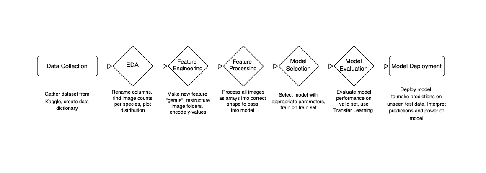

# Duck Duck Choose: Pecking at Pixels with Machine Learning

### Streamlit App: 

Classifying birds into 75 species using a CNN transfer-learning model: 

https://duck-duck-choose.streamlit.app/

# Project Motivation

This project aims to enhance the efficiency and effectiveness of data collection in wildlife conservation using Computer Vision (CV) techniques. According to conservation scientists, [current data collection approaches are not adequate](https://sekercioglu.biology.utah.edu/PDFs/2020%20Monitoring%20the%20world's%20bird%20population%20with%20community%20science%20data.pdf). By improving the ability to accurately classify bird species from images, the project seeks to lessen the data documentation burden on developing countries and facilitate research in challenging or extensive geographical areas, such as tracking migration patterns across continents. 

Computer Vision, a branch of artificial intelligence, allows computers to process and interpret visual information similarly to human sight. A well-trained CV model can handle a large volume of images, greatly aiding in ecological studies by enabling efficient data gathering on species distribution, monitoring migratory paths, assessing environmental impacts, and analyzing collective behaviors to inform conservation strategies.


## Data set

This project uses this [dataset](https://www.kaggle.com/datasets/gpiosenka/100-bird-species), which consists of 84635 training images, 2625 test images, and 2625 validation images across 525 bird species. There are no null or duplicate values. The images were cropped so that the bird in most cases occupies at least 50% of the pixel in the image, then resized to 224 X 224 X3 in jpg format. Each species has at least 130 training images. 

The data is pre-split into test, valid and train. 

## Data Dictionary

<table>
  <tr>
    <th style="text-align: left;">Column Name</th>
    <th style="text-align: left;">Description</th>
  </tr>
  <tr>
    <td style="text-align: left"> <code>labels</code> </td>
    <td style="text-align: left">bird species associated with the image file</td>
  </tr>
    <tr>
    <td style="text-align: left"><code>scientific label</code></td>
    <td style="text-align: left">scientific name for the bird species</td>
  </tr>
  <tr>
    <td style="text-align: left"><code>filepaths</code></td>
    <td style="text-align: left">the relative file path to an image file</td>
  </tr>
    <tr>
    <td style="text-align: left"><code>data set</code></td>
    <td style="text-align: left">which dataset (train, test or valid) the image filepath belongs to</td>
  </tr>
      <tr>
    <td style="text-align: left"><code>data set</code></td>
    <td style="text-align: left">which dataset (train, test or valid) the image filepath belongs to</td>
  </tr>
       <tr>
    <td style="text-align: left"><code>class_id</code></td>
    <td style="text-align: left">the class index value associated with the image file's class</td>
  </tr>

</table>

### Dependencies

* Install all the basic packages we'll need.

```
conda install numpy=1.19.2 pandas=1.3.5 matplotlib jupyter 
```

* Tensorflow 2.13.0: 
```
conda install -c conda-forge tensorflow=2.13.0
```

* SciKit Learn: 
```
conda install scikit-learn=0.24.1 
```

* opencv-python for image to array
```
conda install opencv-python
```

* Pillow for image display
```
conda install Pillow
```

* rembg for background removal
```
conda install rembg
```

## Project Organization

At the root of this project are the original image folders split into ```train```, ```valid```, and ```test```  datasets, and the original ```birds.csv``` listing all 525 species. 

### Base CNN model
For a simple proof of concept, I decided to simplify my dataset by merging species into genuses and constraining my dataset to only 4 genuses with the greatest number of training images. This resulted in DUCK, WARBLER, PHEASANT, and KINGFISHER. I restructured my image folders as well, creating new folders for ```train-genus```, ```valid-genus```, and ```test-genus```, for the species' image folder to live inside. 

<table>
  <tr>
    <th style="text-align: left;">Genus Name</th>
    <th style="text-align: left;">Count of Images</th>
  </tr>
  <tr>
    <td style="text-align: left"> <code>DUCK</code> </td>
    <td style="text-align: left">1510</td>
  </tr>
    <tr>
    <td style="text-align: left"><code>WARBLER</code></td>
    <td style="text-align: left">1391</td>
  </tr>
  <tr>
    <td style="text-align: left"><code>PHEASANT</code></td>
    <td style="text-align: left">1303</td>
  </tr>
    <tr>
    <td style="text-align: left"><code>KINGFISHER</code></td>
    <td style="text-align: left">1298</td>
</table>

### Optimized Transfer Learning Model
For my transfer learning model, I decided to give up genus in favour of species, and widened my scope to 75 species, selecting those with the greatest image count. I copied these images into new folders called `train-75`, `valid-75`, and `test-75` within the Sprint 4 directory. I also saved the image file path and the species of these into csv files: '`df_train_75.csv` and so on. Here is a visualization of some of the 75 species:


 

## Project Flowchart
My project direction will align with the following steps. Due the pre-split nature of my data, I didn't need to split train, valid and test data. 

<div style="background-color: white; padding: 10px;">

</div>

## Data Cleaning 
Using the python library `rembg`, I removed the backgrounds from the images 

<div style="background-color: white; padding: 10px;">

</div>

## Data Augmentation
Using ImageDataGenerator, I have performed data augmentation which did the following transformations on my data to increase the sample size that my model can learn from: 

``` 
    rotation_range=40,    # Rotate the images up to 40 degrees
    width_shift_range=0.2, # Shift the images horizontally by up to 20%
    height_shift_range=0.2,# Shift the images vertically by up to 20%
    shear_range=0.2,      # Shear transformation
    zoom_range=0.2,       # Zoom in/out
    horizontal_flip=True, # Allow horizontal flipping
    fill_mode='nearest'   # Strategy for filling in newly created pixels

```
In my transfer model training, I replaced these manual transforms with `tf.keras.applications.efficientnet.preprocess_input` as the preprocessing function for input into a customized EfficientNetB0 model.

# Base Model Evaluation 
My base CNN Mode's accuracy was 87%. My model predicted Ducks accurately 76% of the time, Kingfishers 90% of the time, Pheasants 90% of the time, and Warblers 93% of the time. Limitations of the dataset are male/female species characteristics variability and class imbalance and juvenile/adult variability in physical characteristics.

# Base Model Evaluation
### Confusion Matrix
<div style="background-color: white; padding: 10px;">

</div>

The base CNN model does the best at predicting Warblers and the worst at predicting Ducks, perhaps due to the larger intra-genus image variability of ducks.

### Incorrect Predictions
<div style="background-color: white; padding: 10px;">

</div>

The base model is incorrectly predicting images based on the predicted species having similar colour, size, and pattern to the true species. The model may be too simple for this classification task, so I want to compare its results to a more sophisticated pretrained model.
 

## Transfer Learning Model
To improve my model and to widen the scope to include 75 species in my data set, I decided to implement transfer learning, which involves taking a neural network model that has been previously trained on one dataset and tweaking it to work with a new dataset. 

<div style="background-color: white; padding: 10px;">

</div>


Here are the key steps and configurations used in the model setup:

1. Loading Pre-trained Model: EfficientNetB0 is initialized with ImageNet weights, but with the top layer excluded (include_top=False). This modification makes the model suitable for custom outputs, rather than the 1,000 classes it was originally designed for. The input shape is explicitly set to match the specific requirements of the dataset.
```
pretrained_model = EfficientNetB0(weights='imagenet',
                  pooling='max',
                   include_top=False, #this is too specific, this will hurt performance on my dataset
                   input_shape=(height,width,channels))
```

2. Freezing Layers: All layers of the pre-trained model are set to non-trainable. This means that during backpropagation, the weights of these layers will not be updated, preserving the features learned from ImageNet.

```
for layer in pretrained_model.layers:
    layer.trainable = False 
```

3. Adding Custom Layers: To tailor the model to a new task, several layers are added to the architecture:
- Preprocessing: A Lambda layer applies the preprocess_input function from EfficientNetB0, ensuring the input data format suits the model.
- Dense and Dropout Layers: After the pre-trained model, the sequence includes a Dense layer with 256 neurons and ReLU activation, followed by a Dropout layer with a rate of 0.45 to reduce overfitting. This pattern repeats with a Dense layer of 512 neurons.
- Output Layer: The final Dense layer uses softmax activation to output probabilities across 75 classes, aligning with the new task's requirements. The activation='softmax' argument specifies that the softmax activation function should be used. Softmax is ideal for the final layer of a multi-class classification model because it converts the model's output scores into probabilities for each class.

```
preprocess_input = tf.keras.applications.efficientnet_v2.preprocess_input

eff_model = Sequential([
    tf.keras.layers.Lambda(preprocess_input),  #  preprocess inputs for EfficientNetB0
    pretrained_model,  # Add the pretrained model
    Dense(256, activation='relu'),  # Add  custom dense layers
    Dropout(0.45),
    Dense(512, activation='relu'),
    Dropout(0.45),
    Dense(75, activation='softmax')
])
```

4. Model Compilation:
- Optimizer: The Adam optimizer is used with a learning rate of 0.0001. Adam is a popular choice for deep learning tasks due to its efficient handling of sparse gradients and adaptive learning rate capabilities.
- Loss Function: The model is compiled with sparse_categorical_crossentropy as the loss function, appropriate for multi-class classification tasks where the labels are provided as integers.
- Metrics: Accuracy is monitored as a metric to evaluate the model's performance during training and validation.

```
eff_model.compile(optimizer=Adam(0.0001),
              loss='sparse_categorical_crossentropy',
              metrics=['accuracy'])
```

5. Setting Callbacks:
- EarlyStopping: This callback is configured to monitor the validation loss (val_loss). Training will stop if there is no improvement in validation loss for five consecutive epochs. The best model weights at the point of lowest validation loss are restored to ensure the best possible model performance.
- ReduceLROnPlateau: Reduces the learning rate when the validation loss plateaus.


```
early_stop = EarlyStopping(monitor = "val_loss", # watch the val loss metric
                               patience = 5,
                               restore_best_weights = True) # if val loss decreases for 5 epochs in a row, stop training

reduce_lr = ReduceLROnPlateau(monitor='val_loss', factor=0.2, patience=3, min_lr=1e-6)
```

6. Model Training:
The fit method is employed to train the model using train_generator for input data and valid_generator for validation data.
- steps_per_epoch is set at 469, (length of train dataset/batch size) defining the number of batches processed before the training epoch is considered complete.
- validation_steps is set at 12, (length of valid dataset/batch size) specifying how many batch steps to run for validation.
- epochs: The model will train up to 85 epochs unless stopped early by the EarlyStopping callback.
- Additional callbacks like tensorboard logging and model checkpoints save the model at various training stages.

```
# Fit the model
history = eff_model.fit(
    train_generator,
    steps_per_epoch=469,
    validation_steps=12,
    epochs=85,
    validation_data=valid_generator,
    callbacks=[early_stop,
              create_tensorboard_callback("training_logs", "bird_classification"),
              checkpoint_callback,
              reduce_lr
        ]
)
```

This setup effectively balances the need to train deeply for high accuracy while implementing mechanisms to prevent overfitting and ensure that the model generalizes well on unseen data.


## Visualize classes
Below is a sampling of the images the model was trained on 
<div style="background-color: white; padding: 10px;">

</div>


## Transfer Learning Accuracy
My transfer learning model accuracy was 100%, which is much better than my base CNN model. I can conclude that EfficientNet's pre-trained layers are excellent for my classification task. On my web app, the degree of confidence shows greater than 99% with a floating point. 
<div style="background-color: white; padding: 10px;">

</div>


## Saliency maps
Saliency maps show which image features were crucial for the model
<div style="background-color: white; padding: 10px;">

</div>


 ## Next Steps
I would like to compare accuracy scores when passing in grayscale images vs colour, and transparent no-background images vs. images with backgrounds. Once the model is optimized, I'd like to load it into my web app.

For the web app, I'd like to provide more feedback on classification result on my Streamlit app, such as the model's second or third choices for classification. 


## Learnings
I have gained experience in various aspects, such as feature engineering for datasets with multiple classes, implementing data augmentation techniques, encoding images as arrays for comparison with average RGB histograms, preprocessing images for transfer learning, analyzing confusion matrices, optimizing transfer learning models, as well as saving and loading models for integration into web applications and deployment.


## Author
Larissa Huang


## Acknowledgments
Inspiration, code snippets, etc.
* [Medium article by Raghunath D about OpenCV image histograms](https://medium.com/@rndayala/image-histograms-in-opencv-40ee5969a3b7)
