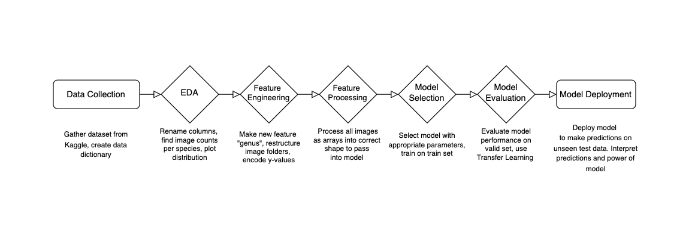

# Duck Duck Choose: Pecking at Pixels with Machine Learning

# Project Overview

This project utilizes Computer Vision techniques to increase the quality and quantity of data collected in the conservation field. If successful, it will reduce the burden on developing countries to accurately document wildlife-related data, as well as aid in data collection for geographically challenging or expansive areas (for example: a migration pattern from North America to South America).

The project will attempt to find a solution to the following: 

"How might we use Computer Vision to increase the accuracy of bird species classification based on images?"

Computer Vision (CV) is a field of artificial intelligence that trains computers to interpret and understand the visual world. A properly trained model can accurately identify and classify large quantities of images. 

CV has many applications in the wildlife conservation field, such as helping researchers to:
* gather data effectively on population and geographical distribution of species
* track migratory patterns and impacts of ecological changes
* study behaviour collectively and make strategies to conserve species

[Source](https://aiworldschool.com/research/this-is-why-ai-in-wildlife-conservation-is-so-glorious/)

This project relies heavily on the interpretation of the relative difference or similarity of bird images across different species. 
Some [background information](https://www.allaboutcircuits.com/technical-articles/image-histogram-characteristics-machine-learning-image-processing/) on image histograms may be required. 

# Project Motivation

A 2022 [study](https://news.cornell.edu/stories/2022/05/global-bird-populations-steadily-decline) revealed that 48% of existing bird species worldwide are known or suspected to be undergoing population declines. Populations are only stable for 39% of species. Only 6% are showing increasing population trends, and the status of 7% is still unknown. Birds are important ecological indicators that are critical to many environmental monitoring schemes, bidiversity assessments and conservation decision-making.

Common reasons for the decline in bird populations include agricultural activity, urban development, natural resource extraction, chemical pesticides, and industrial contaminants. Loss of bird habitat affects both terrestrial and aquatic environments, including marine areas. 

According to conservation scientists, [current data collection approaches are not adequate](https://sekercioglu.biology.utah.edu/PDFs/2020%20Monitoring%20the%20world's%20bird%20population%20with%20community%20science%20data.pdf) for monitoring species across geographic ranges can be difficult and resource intensive, and rely too heavily on community data, which may be lacking in both data quantity and quality. 

In a few countries, birds are monitored using government-coordinated surveys that produce reliable national-level population trends. However, formal surveys such as these are often expensive, infrequent, not comprehensive, and don't capture the seasonal habits of species. Further, formal surveys may be lacking in developing nations due to the resources required. This is especially concerning because these regions harbor the majority of the world's bird species. 


## Data set

This project uses this [dataset](https://www.kaggle.com/datasets/gpiosenka/100-bird-species), which consists of 84635 training images, 2625 test images, and 2625 validation images across 525 bird species. There are no null or duplicate values. The images were cropped so that the bird in most cases occupies at least 50% of the pixel in the image, then resized to 224 X 224 X3 in jpg format. Each species has at least 130 training images. 

The data is pre-split into test, valid and train, so I didn't need to do my own split. I decided to keep the size at 224 x 224 rather than downsizing because I wanted my model to be able to distinguish as much visual data as possible. 

## Data Dictionary

<table>
  <tr>
    <th style="text-align: left;">Column Name</th>
    <th style="text-align: left;">Description</th>
  </tr>
  <tr>
    <td style="text-align: left"> <code>labels</code> </td>
    <td style="text-align: left">bird species associated with the image file</td>
  </tr>
    <tr>
    <td style="text-align: left"><code>scientific label</code></td>
    <td style="text-align: left">scientific name for the bird species</td>
  </tr>
  <tr>
    <td style="text-align: left"><code>filepaths</code></td>
    <td style="text-align: left">the relative file path to an image file</td>
  </tr>
    <tr>
    <td style="text-align: left"><code>data set</code></td>
    <td style="text-align: left">which dataset (train, test or valid) the image filepath belongs to</td>
  </tr>
      <tr>
    <td style="text-align: left"><code>data set</code></td>
    <td style="text-align: left">which dataset (train, test or valid) the image filepath belongs to</td>
  </tr>
       <tr>
    <td style="text-align: left"><code>class_id</code></td>
    <td style="text-align: left">the class index value associated with the image file's class</td>
  </tr>

</table>

### Dependencies

* Install all the basic packages we'll need.

```
conda install numpy=1.19.2 pandas=1.3.5 matplotlib jupyter 
```

* Mac users should install Tensorflow 2.7.0: 
```
conda install -c conda-forge tensorflow=2.7.0
```

* Windows users should install Tensorflow 2.3.0: 
```
conda install -c conda-forge tensorflow=2.3.0
```

* Install SciKit Learn: 
```
conda install scikit-learn=0.24.1 nltk
```

* This project requires opencv-python to run
```
conda install opencv-python
```

* This project requires Pillow for image display
```
conda install Pillow
```

* This project requires rembg for background removal
```
conda install rembg
```

## Project Organization

At the root of this folder, I will have the original ```train```, ```valid```, and ```test``` data sets, as well as the new folders I've created in my feature engineering. I will have the original ```birds.csv``` . 

## Data Restructuring

In order to have more images for each class, I decided to merge species of the same genus into one category. This way, I have more data per category. To retain a high quantity of training images, I will drop all genera with fewer than 1200 training images, using only DUCK, WARBLER, PHEASANT, and KINGFISHER. 

<table>
  <tr>
    <th style="text-align: left;">Genus Name</th>
    <th style="text-align: left;">Count of Images</th>
  </tr>
  <tr>
    <td style="text-align: left"> <code>DUCK</code> </td>
    <td style="text-align: left">1510</td>
  </tr>
    <tr>
    <td style="text-align: left"><code>WARBLER</code></td>
    <td style="text-align: left">1391</td>
  </tr>
  <tr>
    <td style="text-align: left"><code>PHEASANT</code></td>
    <td style="text-align: left">1303</td>
  </tr>
    <tr>
    <td style="text-align: left"><code>KINGFISHER</code></td>
    <td style="text-align: left">1298</td>
</table>

Based on this new feature, I restructured my image folders as well, creating new folders for ```train-genus```, ```valid-genus```, and ```test-genus```, for the species' image folder to live inside. 


## Project Flowchart

My project direction will align with the following steps. Due the pre-split nature of my data, I didn't need to split train, valid and test data. 

<div style="background-color: white; padding: 10px;">

</div>

## Data cleaning 
Using the python library `rembg`, I removed the backgrounds from the images 

<div style="background-color: white; padding: 10px;">

</div>

## Project Progression

I have completed the Data Collection, Data Cleaning and EDA, Feature Engineering, and my selected Base Model: CNN without Transfer Learning. I have determined this will be a classification problem. First, as a proof of concept, I classified bird images into 1 of 4 genera using a base CNN model: 

- DUCK
- WARBLER
- KINGFISHER
- PHEASANT

Using ImageDataGenerator, I have performed data augmentation which did the following transformations on my data to increase the sample size that my model can learn from: 

- scale pixel values to between 0 and 1 
- rotate images 
- shift images off-center 
- slant images 
- zoom in or out 
- flip images horizontally 

My base CNN Mode's accuracy was 87.6%. 

Next, I will implement Transfer Learning using the following pre-trained CNNs: 

- ResNet50
- EfficientNetB7

After optimizing hyperparameters such as batch size and epochs, 

## Model Scores
TODO: rewrite

Training accuracy, weighted recall, weighted precision, and weighted F1 

Test scores
Among all training images, the model had the hardest time classifying _________

Recall score 
F1 score
Most frequently mistook ___ for ____ 

## Streamlit App 

 TODO: rewrite 
 I created a publically hosted application using Streamlit to showcase this project. Users can select from any of the images I used for testing and see how the model would classify it.

## Learnings

## Conclusions
Saliency map

## Next steps
Implement an image upload field for user to upload their own bird image, with rescaling UI for model ingestion. 

Compare grayscale vs colour

Compare no backgrounw with background 


## Author

Larissa Huang


## Acknowledgments

Inspiration, code snippets, etc.
* [Medium article by Raghunath D about OpenCV image histograms](https://medium.com/@rndayala/image-histograms-in-opencv-40ee5969a3b7)
